# 操作系统实验报告

## 实验基本信息

| 项目 | 内容 |
| --- | --- |
| **实验名称** | Lab 1：比麻雀更小的麻雀（最小可执行内核） |
| **小组成员** | 2410625-吴宇轩、2410849-张祖浩、2410878-吕明诺 |
| **完成日期** | |

### 小组分工

练习与模块分工：

| 成员 | 负责的练习/模块 |
| --- | --- |
| 2410625-吴宇轩 | 从机器启动到内核运行，OpenSBI、BIN、ELF；练习二：GDB 验证启动流程 |
| 2410849-张祖浩 | 内存布局、链接脚本、入口点；练习一：分析 entry.S 与 kern_init，验证栈指针和入口跳转 |
| 2410878-吕明诺 | 从 SBI 到 stdio、Just make it；梳理输出与构建链路，运行验证，并核对前两个练习 |

报告分工：吴宇轩撰写启动流程与练习二；张祖浩撰写内存布局、链接脚本与练习一；吕明诺撰写输出封装、构建流程与 AI 协作经验。整体逻辑、测试结果和知识点由小组共同核对，各阶段保留各自的分析和表达。

---

## 一、实验目的

本实验的主要目的是：

1. 理解最小 RISC-V 内核的构建过程，分清 ELF 文件与原始二进制镜像的作用。
2. 理解 CPU 从复位代码进入 OpenSBI、再进入内核的顺序，以及固件和内核各自承担的工作。
3. 阅读链接脚本和入口代码，理解进入 C 函数前为什么需要确定内存布局、设置启动栈并完成初始化。
4. 梳理 SBI 到格式化输出的调用链，使用 GDB 和 QEMU 将源码分析与实际运行情况对应起来。

框架已提供本实验的主要功能，工作以阅读、分析和运行验证为主。各成员对调试工具和启动方式做了环境适配，不将已有框架描述为本组从头实现的代码。

---

## 二、实验环境

使用的 AI 工具：

| 成员 | AI 编程工具 | 底层模型 | 备注 |
| --- | --- | --- | --- |
| 2410625-吴宇轩 | | | 以提供的源码分析和 GDB 实测记录为依据 |
| 2410849-张祖浩 | Codex 桌面应用 | GPT 6.1 Sol | 辅助环境配置、代码分析；使用 Otty 记录实验结果 |
| 2410878-吕明诺 | DeepSeek Harness | DeepSeek-V4-Flash | 辅助调用链与构建流程分析 |

**说明：**

- **AI 编程工具**指具体使用的应用或交互工具。
- **底层模型**指工具使用的大语言模型及版本。未记录的信息不根据工具名称推断。

实验运行环境：

| 成员 | 实验环境与工具 | 说明 |
| --- | --- | --- |
| 吴宇轩 | Ubuntu 24.04（WSL2）；QEMU 8.2.2；GDB multiarch 15.1；RISC-V GCC 13.2.0 | 在个人实验副本中使用 -kernel 解决新版 QEMU 的入口传递问题，使用多架构 GDB |
| 张祖浩 | Apple Silicon macOS；Docker 中的 ARM64 Ubuntu 24.04；QEMU 8.2.2；GDB multiarch 15.1； | 容器包装命令为原有加载参数补充 -kernel，保留课程 Makefile；使用独立 Otty 窗口取证 |
| 吕明诺 | Ubuntu 虚拟机；RISC-V 工具链；QEMU；DeepSeek-V4-Flash | 原始截图显示 OpenSBI v0.4；其环境与其他成员不同，未提供的工具版本不另作推断 |

报告中的符号地址和寄存器值对应截图所属成员的构建与运行环境。除约定的加载地址外，其他地址不应视为所有环境都固定不变。AI 工具用于分析和文字整理，其回答需与实际代码和调试记录核对。

---

## 三、实验整体逻辑分析

### 2.1 本章节的逻辑主线

本章围绕一个核心主题展开：如何让一个“一无所有”的内核运行起来，并输出第一句话。阅读时，可以先理解固件与内核的分工，再确定内存布局和入口，接着理解 SBI 输出封装，最后通过构建和调试检验这些环节是否配合正确。


### 2.2 功能的逐步实现

实际操作顺序与阅读顺序有所不同。必须先将源码编译、链接并生成镜像，才能在 QEMU 中观察运行：

```text
C / 汇编源码
  → 交叉编译生成目标文件
  → 链接脚本规定布局，生成 ELF 内核
  → objcopy 生成原始镜像
  → QEMU 放置固件和内核镜像
  → 0x1000：复位代码
  → 0x80000000：OpenSBI 初始化与移交控制权
  → 0x80200000：kern_entry 设置启动栈
  → kern_init 清零相应区域并调用 cprintf
  → SBI 服务输出字符
  → 无限循环
```

首先安排地址和入口，是为了让加载位置与编译链接时的约定对应。进入 C 代码前设置栈，是为了使函数调用具备可用的运行空间。建立输出能力后，启动信息才能成为观察内核运行的依据。Makefile 将这条构建和运行链路组织起来，GDB 则用于检查最终输出之外的中间过程。

普通用户程序依靠操作系统完成加载与运行环境准备。本实验中的内核需要自行处理这些准备工作，同时借助 OpenSBI 提供底层服务。宿主 Linux 或 macOS 负责运行开发工具，并不为模拟机器中的内核提供用户程序运行时。

---

## 四、实验内容与实现

本部分先回答练习一涉及的内存布局与入口问题，再回答练习二涉及的启动调试问题，之后说明输出模块和构建模块。已有代码的职责、分析过程与实测结果分别说明。

### 功能模块：内存布局、链接脚本与入口点

**负责人：** 2410849-张祖浩

#### 模块功能描述

**需要实现/修改的函数：**

本模块无需补写框架代码，主要理解以下函数、汇编入口和链接符号：

```c
int kern_init(void) __attribute__((noreturn));
void *memset(void *s, char c, size_t n);
extern char edata[], end[];
```

`kern_entry` 是汇编标签，不是 C 函数；`bootstack` 与 `bootstacktop` 标记启动栈边界。链接脚本指定入口与各区域地址，汇编入口建立栈，`kern_init` 完成清零与启动输出。

**功能说明：**

这一部分主要研究内核怎样从一段汇编代码进入 C 函数。

本实验中，内核启动时还没有现成的操作系统替它准备运行环境，因此这些原本不太容易注意到的步骤需要由内核自己完成。

本部分主要阅读 `tools/kernel.ld`、`kern/init/entry.S` 和 `kern/init/init.c`。验证时使用容器中的 RISC-V 工具链与 QEMU，在 Otty 中查看构建结果并运行 GDB。这里重点观察内核入口附近的执行情况，完整的固件启动过程由启动流程部分展开。

#### 内存布局与链接脚本

程序中的内容用途不同，链接脚本会把它们分别放入相应区域。例如，`.text` 保存指令，`.rodata` 保存只读数据，`.data` 保存已经初始化的可读写数据，`.bss` 用于需要初始化为零的数据。栈则为函数运行提供存储空间。

在 `tools/kernel.ld` 中，下面几行决定了内核的架构、入口和起始地址：

```ld
OUTPUT_ARCH(riscv)
ENTRY(kern_entry)
BASE_ADDRESS = 0x80200000;
```

`ENTRY(kern_entry)` 指定 ELF 文件的入口符号。`BASE_ADDRESS` 与后面的 `. = BASE_ADDRESS` 决定内核从哪个地址开始安排内容。这里的 `.` 可以理解为链接器当前安排到的位置；某个区域放置结束后，它会继续向后移动。

我对链接脚本的理解是，它把多个目标文件中的代码和数据组合起来，并为它们确定地址。这个地址需要与运行时的加载位置对应。当前环境将内核镜像加载到 `0x80200000`，因此链接脚本也从这个位置开始布局。

这里还需要区分“记录入口”与“让 CPU 执行入口”。`ENTRY` 在 ELF 中记录入口信息，但 CPU 真正开始执行内核，还需要启动阶段把控制权交到相应地址。当前 QEMU 命令使用的原始镜像没有 ELF 头，运行位置也不能只靠 `ENTRY` 自动确定。

脚本中的代码段规则如下：

```ld
.text : {
    *(.text.kern_entry .text .stub .text.* .gnu.linkonce.t.*)
}
```

它收集输入文件中的相应代码段。需要结合当前源码理解：`entry.S` 实际声明的是 `.text`，并没有单独声明 `.text.kern_entry`。本次链接仍将 `kern_entry` 放到了代码段开头，最终是否符合预期，可以通过生成文件检查，而不只看脚本中的名称。

另一个容易误解的语句是：

```ld
. = ALIGN(0x1000);
```

它把当前位置调整到下一个合适的 `0x1000` 整数倍，也就是按 4096 字节对齐。看到 `.data` 实际从 `0x80201000` 开始后，我才更清楚这里的对齐是怎样影响布局的。

#### 实际布局检查

构建后，使用 `readelf` 查看文件头和段信息，用 `nm` 查看符号地址：

```bash
make
riscv64-unknown-elf-readelf -h bin/kernel
riscv64-unknown-elf-readelf -SW bin/kernel
riscv64-unknown-elf-nm -n bin/kernel
```

本次得到的主要结果如下。表中地址区间左端包含、右端不包含。

| 内容 | 地址或范围 | 观察结果 |
| --- | --- | --- |
| `.text` | `0x80200000` 至 `0x802004c0` | 保存内核指令 |
| `.rodata` | `0x802004c0` 至 `0x80200730` | 保存只读数据 |
| `.data` | `0x80201000` 至 `0x80203000` | 本次主要对应预留的启动栈 |
| `.sdata` | `0x80203000` 至 `0x80203008` | 保存较小的已初始化数据 |
| `kern_entry` | `0x80200000` | 与 ELF 入口地址一致 |
| `kern_init` | `0x8020000a` | C 初始化函数入口 |
| `bootstack` | `0x80201000` | 启动栈低地址边界 |
| `bootstacktop` | `0x80203000` | 启动栈高地址边界 |
| `edata`、`end` | 均为 `0x80203008` | 本次需要清零的区间长度为零 |

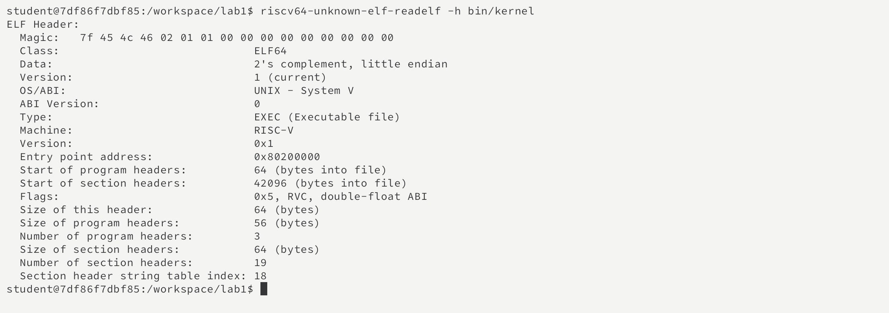

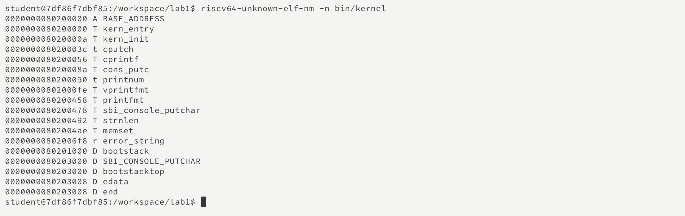

把这些结果与链接脚本对应起来之后，内存布局就不再只是几段抽象的名称。例如，`.rodata` 结束后并没有立即接 `.data`，而是经过对齐后从 `0x80201000` 开始。启动栈也确实占用了这里预留的空间。

以上地址对应当前代码和工具链。后续增加代码或变量后，部分地址可能变化，需要重新检查生成结果。

#### C 初始化函数的准备

`kern/init/init.c` 中，`kern_init()` 首先执行：

```c
extern char edata[], end[];
memset(edata, 0, end - edata);
```

`edata` 和 `end` 是链接脚本提供的地址符号，用于标记需要清零的区域边界。它们不是这里另外创建的两个普通数组。清零操作是为了满足 C 程序对未显式初始化的全局变量应当为零的要求。

本次符号检查中，二者均为 `0x80203008`，差值为零，段列表也没有非空的 `.bss`。因此，这次可以验证清零逻辑及其边界，但不能声称观察到了某个全局变量从非零变为零。

进入 C 函数后，机器指令还会进一步使用入口代码准备的栈。GDB 在函数前面的栈调整指令执行后显示：

```text
sp = 0x80202ff0
```

它比初始值 `0x80203000` 小 16 字节。后续指令会将 `ra` 保存到 `8(sp)`，并调用 `memset`。这说明设置栈并不是一个形式上的步骤，C 函数确实马上开始使用这块内存。

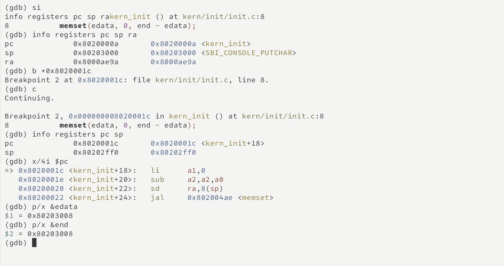

完成准备后，函数调用 `cprintf` 输出启动信息，并停留在 `while (1)` 中。输出的实现由输出模块分析。对于本部分，我更关注进入这些函数之前，栈和数据区域是否已经准备好。

#### 最终提示词

````markdown

````

#### 实现迭代过程

**迭代次数：**

##### 第一次迭代

**遇到的问题：**

**问题解决策略：**

**最终结果：**

**关键改进点总结（如有）：**


### 练习：练习一——理解内核启动中的程序入口操作

**负责人：** 2410849-张祖浩

本练习回答 `la sp, bootstacktop` 与 `tail kern_init` 分别完成什么操作、目的是什么。

#### `la sp, bootstacktop` 的作用

`kern/init/entry.S` 的入口代码很短：

```asm
kern_entry:
    la sp, bootstacktop
    tail kern_init
```

`sp` 是栈指针，表示当前栈的位置。`la sp, bootstacktop` 将 `bootstacktop` 的地址放入 `sp`，使内核开始使用自己预留的启动栈。这里取的是地址，而不是读取该地址处的数据。

这个操作的目的，是为后续 C 函数运行准备可用的栈。函数调用可能需要保存返回地址、寄存器和局部变量，因此不能只跳到一个 C 函数就假定它已经具备运行条件。进入内核时，`sp` 还保留着前一阶段的值，内核需要把它改为自己准备的地址。

启动栈的定义也在 `entry.S` 中：

```asm
.section .data
.align PGSHIFT
bootstack:
    .space KSTACKSIZE
bootstacktop:
```

当前代码中 `PGSHIFT = 12`，这条汇编对齐指令按 `2^12 = 4096` 字节对齐。`KSTACKSIZE` 等于两个内存页，共 8192 字节。`.space` 在这里预留空间，两个标签分别标出这块空间的起点和终点。

RISC-V 的栈向低地址增长，因此初始 `sp` 放在高地址边界 `bootstacktop`。开始使用栈时，函数会先降低栈指针，再在预留区域内保存数据。

#### 调试观察

在暂停状态的 QEMU 中连接 GDB，并在 `kern_entry` 设置断点。调试记录显示，执行入口代码之前：

```text
pc = 0x80200000
sp = 0x80046eb0
```

完成 `la sp, bootstacktop` 对应的两条机器指令后：

```text
pc = 0x80200008
sp = 0x80203000
```

`sp` 与 `bootstacktop` 的地址相等，两个栈边界之差也确实为 8192 字节。`entry.S` 已经预留了栈的空间，这条指令让后续函数从正确的位置开始使用它。

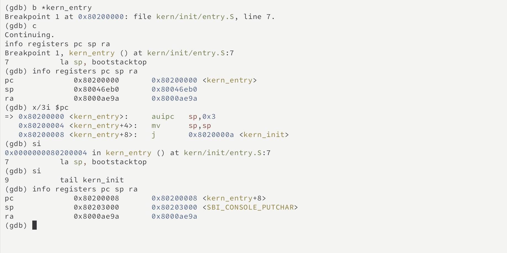

图中 GDB 在 `0x80203000` 后显示了 `SBI_CONSOLE_PUTCHAR`，是因为这个变量与 `bootstacktop` 恰好具有同一数值地址。`bootstacktop` 标记的是栈的边界，栈向更低地址使用；这不表示栈指针设置错误。

#### `tail kern_init` 的作用

`tail kern_init` 把执行位置转到 `kern_init`，使内核从汇编入口进入 C 初始化函数。它不会为返回到入口代码设置新的返回地址。当前函数声明为 `noreturn`，并在最后进入无限循环，所以这里也不需要再回到 `entry.S` 继续执行。

调试时，我注意到源码中的 `tail` 没有直接以同名指令出现在反汇编结果中。本次最终生成的入口代码是：

```asm
0x80200000: auipc sp,0x3
0x80200004: mv    sp,sp
0x80200008: j     0x8020000a <kern_init>
```

`la` 和 `tail` 都是汇编器提供的伪指令，最终形式要看生成的机器代码。在当前构建中，`tail` 被缩短成一条跳转指令。执行该跳转后，`pc` 变成 `0x8020000a`，`sp` 仍为 `0x80203000`，`ra` 则在跳转前后保持 `0x8000ae9a` 不变。这与不设置新的返回地址的行为一致。

这次观察让我注意到，一行汇编源码不一定只执行一次单步就完成。后续调试时，我会同时查看源码和反汇编，避免仅凭源码行号判断执行位置。

---

### 功能模块：从机器启动到内核运行

**负责人：** 2410625-吴宇轩

#### 模块功能描述

**需要实现/修改的函数：**

本模块不要求新增函数，主要分析 QEMU 的复位代码、OpenSBI 的控制权移交和内核入口：

```c
int kern_init(void) __attribute__((noreturn));
```

MROM 复位指令与 `kern_entry` 为汇编代码；OpenSBI 是外部固件，不是本组实现的 C 模块。

**功能说明：**

本部分通过阅读项目目录、Makefile、链接脚本和内核入口代码，分析 Lab1 如何构造并启动一个最小的 RISC-V 内核。这里重点回答项目按照什么逻辑组织、各核心模块承担什么职责，以及实验内容与操作系统原理之间的关系。实际的 GDB 调试过程单独放在后面的“练习二”部分。

#### 项目整体逻辑

Lab1 围绕“让一个最小内核完成编译、加载、启动并输出信息”展开，整体过程可以分为以下几个环节：

1. 使用 RISC-V 交叉编译器将汇编和 C 源文件编译为目标文件。
2. 使用 `tools/kernel.ld` 规定内核的入口地址和各段布局，并链接生成 ELF 文件 `bin/kernel`。
3. 使用 `objcopy` 将 ELF 转换为原始二进制镜像 `bin/ucore.img`。
4. QEMU 创建 RISC-V `virt` 虚拟机，将 OpenSBI 和内核镜像放入内存。
5. CPU 从复位地址 `0x1000` 执行 MROM 代码，然后跳转到 `0x80000000` 的 OpenSBI。
6. OpenSBI 在 M-mode 完成机器级初始化，之后切换到 S-mode，并把控制权交给 `0x80200000` 的内核入口。
7. `kern/init/entry.S` 建立内核栈，再跳转到 C 语言函数 `kern_init()`。
8. `kern_init()` 清零 BSS，通过 SBI 输出启动信息，最后进入无限循环。

这条逻辑线将编译链接、镜像加载、固件初始化、特权级切换、汇编入口、C 语言运行环境和控制台输出连接起来，形成最小但完整的内核启动过程。

#### 核心文件和模块

#### Makefile 和构建过程

`Makefile` 负责调用 `riscv64-unknown-elf-` 工具链完成编译、链接、反汇编和镜像转换。主要产物为：

- `bin/kernel`：ELF 格式内核，包含符号和调试信息，供 GDB 使用；
- `bin/ucore.img`：原始二进制内核镜像，供 QEMU 加载；
- `obj/kernel.asm`：内核反汇编结果；
- `obj/kernel.sym`：内核符号表。

构建过程可以概括为：

```text
.c/.S 源文件 → .o 目标文件 → bin/kernel（ELF）
                              → bin/ucore.img（binary）
```

ELF 文件包含入口地址、段表、符号和调试信息，适合链接、分析和调试；原始二进制镜像主要保留需要装入内存的内容，结构简单，适合由 QEMU 直接加载。

#### 最小内核启动执行流

根据源代码、链接布局和 QEMU 启动方式，完整执行流为：

```text
CPU 加电复位
  → 0x1000：QEMU MROM 复位代码（M-mode）
  → 0x80000000：OpenSBI 固件（M-mode）
  → OpenSBI 完成机器级初始化并准备 SBI 服务
  → 切换到 S-mode，跳转到 0x80200000
  → kern_entry 设置 sp=bootstacktop
  → tail kern_init
  → 清零 BSS
  → 通过 SBI 输出启动信息
  → 进入无限循环
```

需要特别区分三个地址：

| 地址 | 对应内容 | 作用 |
| --- | --- | --- |
| `0x1000` | QEMU MROM | CPU 复位后执行的第一段代码 |
| `0x80000000` | OpenSBI | 固件入口，执行机器级初始化 |
| `0x80200000` | `kern_entry` | ucore 内核入口 |

在本实验的实际环境中，QEMU 使用 `-kernel bin/ucore.img` 在虚拟 CPU 运行前放置内核镜像。OpenSBI 的主要职责是初始化机器环境、提供 SBI 服务、切换特权级并移交控制权。因此，报告中不将其简单描述为“OpenSBI 从硬盘读取并加载内核”。

#### 最终提示词

````markdown

````

#### 实现迭代过程

**迭代次数：**

##### 第一次迭代

**遇到的问题：**

**问题解决策略：**

**最终结果：**

**关键改进点总结（如有）：**


### 练习：练习二——使用 GDB 验证启动流程

**负责人：** 2410625-吴宇轩

#### 实验目的

本练习使用 GDB 跟踪 QEMU 模拟的 RISC-V 处理器，从复位地址开始观察最初几条机器指令，验证处理器如何进入 OpenSBI，并最终在 `0x80200000` 执行内核第一条指令。

#### 调试环境

- Ubuntu 24.04（WSL2）
- QEMU 8.2.2
- `gdb-multiarch` 15.1
- `riscv64-unknown-elf-gcc` 13.2.0

由于 Ubuntu 软件源没有提供项目 Makefile 中默认调用的 `riscv64-unknown-elf-gdb`，本次使用支持 RISC-V 的 `gdb-multiarch` 完成调试。

#### 编译并检查内核

进入实验目录并重新编译：

```bash
cd /home/siamese/oslab/lab1
make clean
make
```

`make clean` 删除旧的构建结果，`make` 重新生成内核 ELF 和二进制镜像。编译完成后检查入口地址：

```bash
riscv64-unknown-elf-readelf -h bin/kernel | grep "Entry point"
```

输出为：

```text
Entry point address:               0x80200000
```

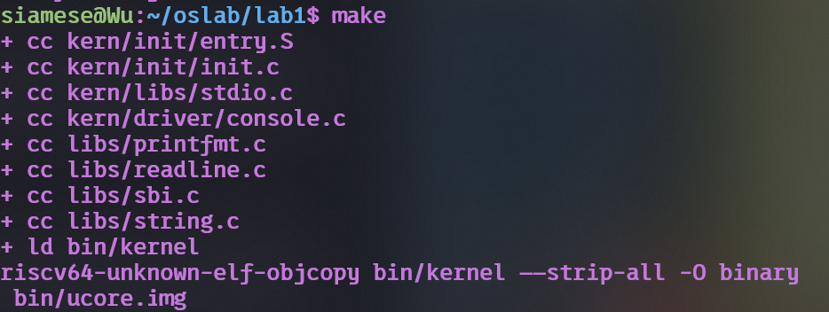

*内核源文件编译、ELF 链接及 `ucore.img` 镜像生成过程。*

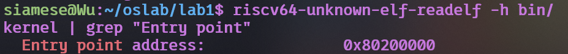

*使用 `readelf` 验证 ELF 入口地址为 `0x80200000`。*

#### 启动 QEMU 调试服务

在第一个终端执行：

```bash
cd /home/siamese/oslab/lab1
make debug
```

该目标使用的关键参数是：

- `-s`：在 TCP 端口 1234 开启 GDB 服务；
- `-S`：虚拟机启动后立即暂停 CPU，等待 GDB；
- `-bios default`：使用 QEMU 自带的 OpenSBI；
- `-kernel bin/ucore.img`：加载内核并向 OpenSBI 提供下一阶段入口信息。

在第二个终端执行：

```bash
cd /home/siamese/oslab/lab1
make gdb
```

`make gdb` 使用带调试符号的 `bin/kernel`，把体系结构设置为 `riscv:rv64`，并连接 `localhost:1234`。

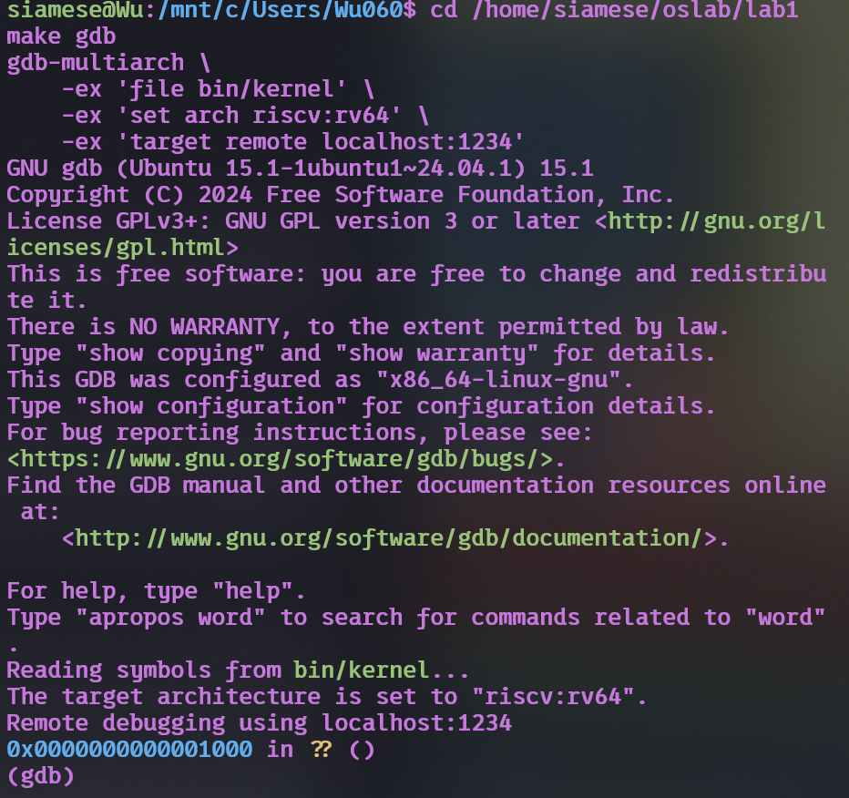

*GDB 载入内核符号、设置 RISC-V 64 位体系结构并连接 QEMU，连接后停在复位地址 `0x1000`。*

#### 阶段一：观察复位地址和最初指令

连接 GDB 后执行：

```gdb
set pagination off
info registers pc
x/8i $pc
```

各命令的意义如下：

| 命令 | 意义 |
| --- | --- |
| `set pagination off` | 关闭分页，便于连续显示和截图 |
| `info registers pc` | 查看当前程序计数器 |
| `x/8i $pc` | 从 PC 指向的位置反汇编8条指令 |

实际观察到：

```text
pc = 0x1000

0x1000: auipc t0,0x0
0x1004: addi  a2,t0,40
0x1008: csrr  a0,mhartid
0x100c: ld    a1,32(t0)
0x1010: ld    t0,24(t0)
0x1014: jr    t0
```

这些指令位于 QEMU 提供的 MROM 中，不属于 ucore 内核。它们取得 hart 编号、设备树地址和固件动态信息地址，再从 MROM 数据区取出 `0x80000000`，跳转到 OpenSBI。


*读取 PC 寄存器，确认 RISC-V 处理器的复位地址为 `0x1000`。*

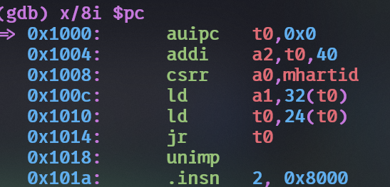

*反汇编 `0x1000` 处的 MROM 复位代码。*

#### 阶段二：单步进入 OpenSBI

连续执行六条机器指令：

```gdb
si
si
si
si
si
si
info registers pc a0 a1 a2 t0
x/8i $pc
```

`si` 表示单步执行一条机器指令。实际寄存器结果为：

```text
pc = 0x80000000
a0 = 0x0
a1 = 0x87e00000
a2 = 0x1028
t0 = 0x80000000
```

其中，`a0=0` 是当前 hart 编号，`a1=0x87e00000` 是设备树地址，`a2=0x1028` 指向固件动态信息。`pc=0x80000000` 证明复位代码已经把控制权交给 OpenSBI。

OpenSBI 入口处的指令为：

```text
0x80000000: add s0,a0,zero
0x80000004: add s1,a1,zero
0x80000008: add s2,a2,zero
0x8000000c: jal 0x80000580
```

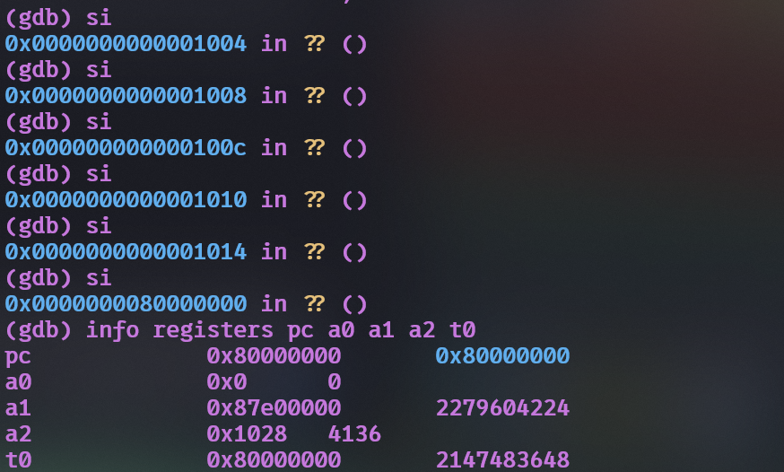

*单步执行六条复位指令后，PC 到达 `0x80000000`，同时观察 OpenSBI 的入口参数。*

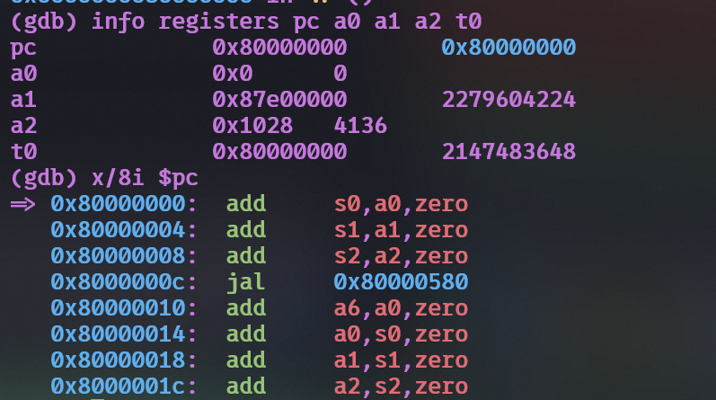

*OpenSBI 入口处的寄存器状态与前八条机器指令。*

OpenSBI 初始化路径较长，没有必要逐条跟踪全部固件指令。其启动信息给出了下一阶段的关键状态：

```text
Firmware Base             : 0x80000000
Domain0 Next Address      : 0x80200000
Domain0 Next Mode         : S-mode
```

这表明 OpenSBI 将以 S-mode 进入地址 `0x80200000` 的内核。

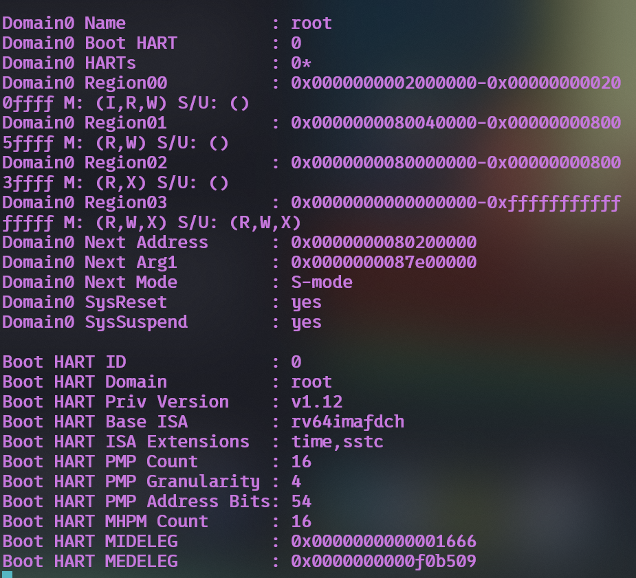

*OpenSBI 输出的下一阶段地址、参数和特权级，其中 `Next Address` 为 `0x80200000`，`Next Mode` 为 S-mode。*

#### 阶段三：断点验证内核入口

设置地址断点并继续运行：

```gdb
break *0x80200000
continue
info registers pc sp a0 a1
x/6i $pc
```

其中，`break *0x80200000` 在指定机器地址设置断点，`continue` 让 OpenSBI 继续执行，直到控制权到达内核入口。

GDB 实际停止在：

```text
Breakpoint 1, kern_entry () at kern/init/entry.S:7
pc = 0x80200000 <kern_entry>
sp = 0x80046eb0
```

入口处反汇编结果为：

```text
0x80200000 <kern_entry>:   auipc sp,0x3
0x80200004 <kern_entry+4>: mv    sp,sp
0x80200008 <kern_entry+8>: j     0x8020000a <kern_init>
```

断点命中 `kern_entry`，直接证明 OpenSBI 已经把控制权交给 ucore 内核。

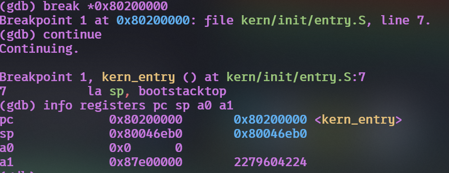

*在 `0x80200000` 设置的断点命中 `kern_entry`，此时内核第一条指令尚未执行。*

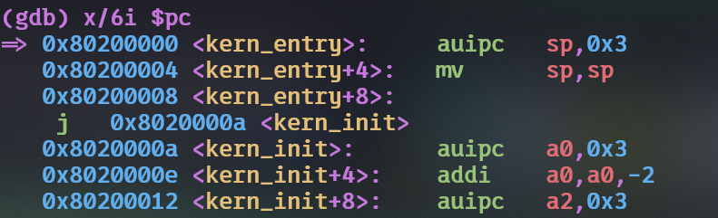

*反汇编内核入口，可看到设置栈指针的指令以及跳转到 `kern_init()` 的指令。*

#### 阶段四：验证内核栈和 `kern_init()`

`la sp, bootstacktop` 在本次构建中展开成前两条机器指令，因此执行两次 `si`：

```gdb
si
si
info registers pc sp
x/3i $pc
```

结果为：

```text
pc = 0x80200008 <kern_entry+8>
sp = 0x80203000 <bootstacktop>
```

这证明内核已经切换到自己的启动栈。继续执行一条指令：

```gdb
si
info registers pc sp
x/5i $pc
```

结果为：

```text
pc = 0x8020000a <kern_init>
sp = 0x80203000
```

这证明 `tail kern_init` 完成了从汇编入口到 C 语言入口的控制权转移，同时保持了刚建立的内核栈。

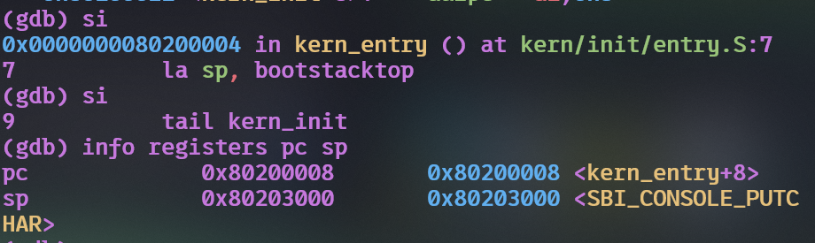

*执行 `la sp, bootstacktop` 后，栈指针变为 `0x80203000`。*

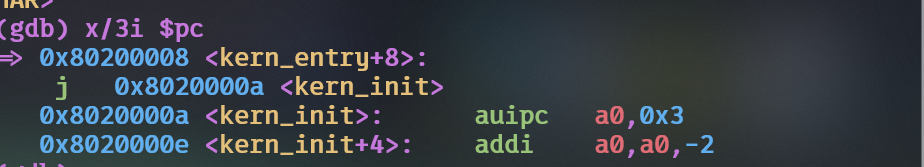

*当前 PC 指向 `tail kern_init` 展开的跳转指令，目标地址为 `0x8020000a`。*

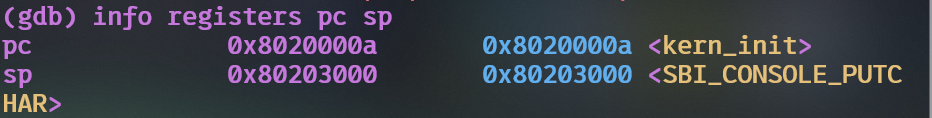

*执行跳转后进入 `kern_init()`，内核栈指针保持为 `0x80203000`。*

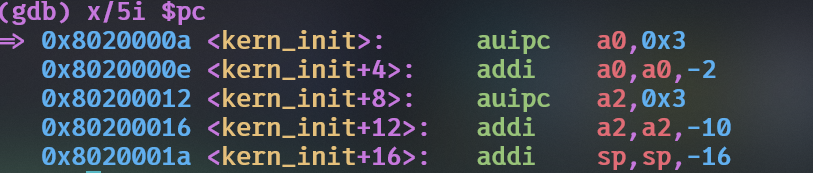

*`kern_init()` 函数入口处的前五条机器指令。*

#### 阶段五：验证内核输出

删除入口断点并继续执行：

```gdb
delete 1
continue
```

QEMU 终端输出：

```text
(THU.CST) os is loading ...
```

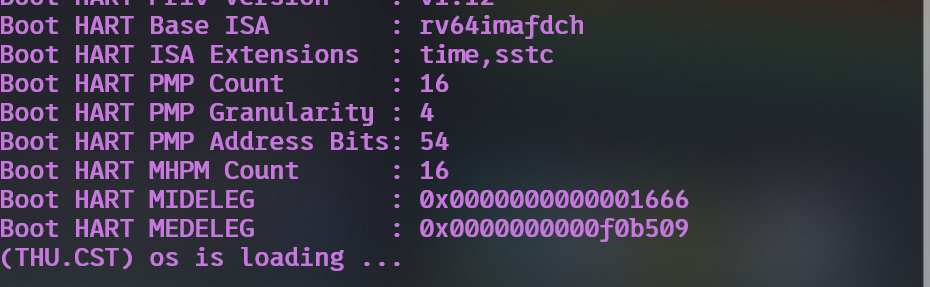

*QEMU 终端成功输出内核启动信息，说明最小内核启动链和 SBI 控制台输出均正常。*

这说明 `kern_init()`、格式化输出函数和 SBI 控制台调用链均能够正常运行。由于内核最终进入无限循环，可在 GDB 中按 `Ctrl+C` 中断，再执行：

```gdb
kill
quit
```

#### 练习问题回答

#### RISC-V 加电后最初执行的指令位于什么地址？

本次调试中，GDB 连接后的 `pc` 为 `0x1000`。因此，QEMU `virt` 平台模拟的 RISC-V CPU 从复位地址 `0x1000` 开始执行。这里存放的是 QEMU 提供的 MROM 复位代码，而不是 OpenSBI 或 ucore 内核代码。

#### 最初几条指令主要完成哪些功能？

最初六条指令主要完成以下工作：

1. 获取复位代码附近的基地址；
2. 读取 `mhartid`，将 hart 编号放入 `a0`；
3. 将设备树 DTB 地址放入 `a1`；
4. 将固件动态信息地址放入 `a2`；
5. 读取 OpenSBI 入口地址 `0x80000000`；
6. 使用 `jr t0` 跳转到 OpenSBI。

随后 OpenSBI 在 M-mode 初始化机器级环境、配置必要的保护和异常委托、建立 SBI 服务，最后切换到 S-mode 并跳转到 `0x80200000`，开始执行 ucore 内核。

#### 如何证明已到达内核入口，并开始执行入口代码？

本实验通过三项相互印证的结果完成验证：

1. `readelf` 显示 ELF 入口地址为 `0x80200000`；
2. OpenSBI 输出 `Domain0 Next Address = 0x80200000`；
3. GDB 的断点在 `0x80200000 <kern_entry>` 命中，说明 CPU 已到达内核入口，但此时第一条指令尚未执行。

之后单步执行还观察到 `sp=0x80203000`，并最终进入 `kern_init=0x8020000a`，进一步证明内核入口代码确实开始执行。

#### `watch *0x80200000` 的实验说明

题目提示可以使用写观察点捕获内核加载瞬间。但本实验采用 `-kernel bin/ucore.img`，QEMU 在虚拟 CPU 开始执行前就已将内核镜像放入内存。GDB 通过调试端口连接时，预加载已经完成，因此运行时设置的普通写观察点无法看到这次写入。

本实验改用 ELF 入口检查、OpenSBI 的 `Next Address` 输出和 `0x80200000` 地址断点共同验证内核加载与控制权移交。相对于只使用观察点，这些证据也能够更清晰地区分“镜像已经位于内存”和“CPU 已经开始执行该镜像”两个事件。

#### 调试过程中遇到的问题及解决方法

#### QEMU 没有进入内核

原始 Makefile 使用：

```text
-device loader,file=bin/ucore.img,addr=0x80200000
```

在本机 QEMU 8.2.2 中，该参数会把镜像写到 `0x80200000`，但默认 OpenSBI 显示：

```text
Domain0 Next Address      : 0x0000000000000000
```

因此 OpenSBI 不知道正确的下一阶段入口，内核不会启动。将 Ubuntu 实验副本的启动参数改为：

```text
-kernel bin/ucore.img
```

之后 OpenSBI 正确显示 `Next Address = 0x80200000`，内核成功启动。这说明“把镜像放入内存”和“把入口地址告知固件”是两个不同条件。

#### 默认 GDB 命令不存在

Makefile 原本使用 `riscv64-unknown-elf-gdb`，但 Ubuntu 24.04 环境中没有该程序。本实验安装并使用 `gdb-multiarch`，再通过：

```gdb
set architecture riscv:rv64
```

明确指定目标体系结构，成功完成远程调试。

#### 练习二小结

通过实际单步调试，本练习确认了 CPU 从 `0x1000` 的 MROM 复位代码开始，随后跳转到 `0x80000000` 的 OpenSBI，最终以 S-mode 进入 `0x80200000` 的 `kern_entry`。内核入口将 `sp` 设置为 `0x80203000`，再跳转到 `kern_init()`，最后通过 SBI 输出启动信息。调试结果将启动文档中的地址、特权级和控制流与真实机器指令及寄存器状态对应起来，完整验证了 Lab1 的最小内核启动链。

---

### 功能模块：从 SBI 到 stdio

**负责人：** 2410878-吕明诺

#### 模块功能描述

**需要实现/修改的函数：**

本模块的输出路径在框架中已实现，涉及理解与验证的函数签名如下：

```c
/* libs/sbi.c —— SBI 调用封装 */
uint64_t sbi_call(uint64_t sbi_type, uint64_t arg0, uint64_t arg1, uint64_t arg2);
void sbi_console_putchar(unsigned char ch);
void sbi_set_timer(unsigned long long stime_value);

/* kern/driver/console.c —— 控制台驱动，类型适配层 */
void cons_putc(int c);
int  cons_getc(void);

/* kern/libs/stdio.c —— 高层输入输出 */
static void cputch(int c, int *cnt);
void cputchar(int c);
int  cputs(const char *str);
int  vcprintf(const char *fmt, va_list ap);
int  cprintf(const char *fmt, ...);
int  getchar(void);

/* libs/printfmt.c —— 格式化引擎 */
void vprintfmt(void (*putch)(int, void *), void *putdat, const char *fmt, va_list ap);
int  snprintf(char *str, size_t size, const char *fmt, ...);
```

**功能说明：**

该模块位于**内核与硬件固件之间**，作用是为内核提供**格式化输出能力**，使内核能够向开发者/用户输出运行信息。

需要处理的主要场景：

- 内核运行在 **S 模式（Supervisor）**，而提供服务的 OpenSBI 固件运行在 **M 模式（Machine）**，二者之间存在特权级壁垒，**无法使用普通函数调用跨越**；
- C 语言本身**无法直接表达 `ecall` 指令**，也**无法指定变量占用哪个物理寄存器**，而 SBI 调用约定要求参数必须位于固定寄存器，因此必须借助**内联汇编**完成寄存器级的参数传递；
- 从"输出一个字符"这一唯一能力出发，需要逐层抽象，最终提供与标准库 `printf` 语义相当的接口。

与其他模块的交互关系：

- **向下**依赖 OpenSBI 固件提供的 `SBI_CONSOLE_PUTCHAR`（功能号 1）服务；
- **向上**为 `kern/init/init.c` 提供 `cprintf`，使 `kern_init` 能输出启动信息；
- 与"内存布局与入口点"模块的交汇点是 `init.c` 中的 `memset(edata, 0, end - edata)`——该语句用到的 `edata` 与 `end` 正是链接脚本 `kernel.ld` 通过 `PROVIDE` 定义的符号。


#### 输出调用链与核心函数分析

下面结合当前代码补充各层如何配合，承接本模块原稿中的功能描述。

```text
kern_init
  → cprintf → vcprintf → vprintfmt
  → cputch → cons_putc → sbi_console_putchar
  → sbi_call → ecall → OpenSBI → 虚拟串口
```

`cprintf` 接收格式字符串和可变数量的参数，使用 `va_start`、`va_end` 管理参数列表；`vcprintf` 把参数列表交给 `vprintfmt`，同时初始化字符计数。格式化引擎解析格式字符串，将需要输出的每个字符交给回调 `cputch`。因此，格式化规则与具体输出设备能够分别处理。`cputch` 一方面调用 `cons_putc`，另一方面更新字符计数，最终由 `cprintf` 返回。

`cons_putc(int c)` 将字符转换为 `unsigned char`，再交给 `sbi_console_putchar`。后者以功能号 1 调用 `sbi_call`，字符作为第一个参数传入，其他两个参数为零。当前框架使用传统的 SBI 控制台接口，不应将它的功能号约定推广到所有 SBI 扩展。

`sbi_call` 中的四条 `mv` 把功能号放到 `x17/a7`，把三个参数放到 `x10/a0`、`x11/a1`、`x12/a2`；执行 `ecall` 后，从 `a0` 取得返回值。这里需要内联汇编，是因为普通 C 表达式无法直接指定这条指令以及调用时的寄存器约定。C 代码仍可以通过已有的汇编包装函数使用该服务。

内联汇编的 `volatile` 告诉编译器不要将这段操作当作无用计算删除；`"r"` 和 `"=r"` 分别约束输入、输出使用寄存器。`"memory"` 告诉编译器这段汇编可能影响内存，限制相关的编译优化，它不是 CPU 的硬件内存屏障。原代码没有完整列出固定寄存器被改写的约束；本实验按框架进行分析和运行验证，不把一次启动成功当作它在所有优化配置下都正确的证明。

当前代码还提供 `cputs`、`snprintf` 等接口，但启动信息实际验证的是 `cprintf` 的输出路径。`cons_getc` 调用了 `sbi_console_getchar`，当前源码只有后者的声明而没有实现，所以本次不能据输出成功声称输入功能也已完成。类似地，提供定时器函数接口也不等于已经实现了内核时钟中断管理。

#### 最终提示词

以下提示词来自本阶段提交的原始报告，用于分析既有代码，不是要求 AI 从头实现输出模块。

````markdown
[PROMPT]
**任务**：阅读 kern/libs/stdio.c、kern/driver/console.c、libs/sbi.c、libs/printfmt.c
四个文件，梳理从 sbi_call 到 cprintf 的完整调用链，说明每一层封装解决的问题。
**操作要求**：只阅读和分析，不修改任何代码。所有结论必须以这四个文件的真实代码为准，
若某函数在文件中不存在，必须明确指出，不得根据其他版本推测。
**输出要求**：给出完整调用链（含函数签名）、每层职责、以及 C 语言为什么必须用内联汇编实现。

[RELY]
// 文件路径
libs/sbi.c、libs/sbi.h、kern/driver/console.c、kern/libs/stdio.c、libs/printfmt.c、libs/stdio.h
// 关键系统约束
内核运行在 S 模式（Supervisor），OpenSBI 固件运行在 M 模式（Machine）
内核不能依赖宿主操作系统的运行时库
// 已知的功能号定义（来自 libs/sbi.c）
SBI_SET_TIMER = 0、SBI_CONSOLE_PUTCHAR = 1、SBI_CONSOLE_GETCHAR = 2

[GUARANTEE]
本任务不涉及代码实现，只需输出分析结论。

[SPECIFICATION]
## 调用链分析
**Pre-Condition**:
- 已读取上述四个文件的完整内容
**Post-Condition**:
- 给出一条从 cprintf 到 ecall 的完整调用链，标注每层的函数签名
- 逐层说明该层封装的目的
- 对 sbi_call 的内联汇编逐行解释，包括四条 mv、ecall、
  输出/输入操作数约束、以及 "memory" clobber 的作用
**Case 1**:
- 若某个函数在文件中不存在，输出"该函数不存在"，不得臆测其实现
**Case 2**:
- 若发现讲义描述与实际代码不一致，单独列出差异点
**Requirements**:
- 引用代码时给出真实函数名与签名，不得使用近似的记忆版本
````


#### 实现迭代过程

**迭代次数：**

##### 第一次迭代

**遇到的问题：**

**问题解决策略：**

**最终结果：**

**关键改进点总结（如有）：**


---

### 功能模块：Just make it

**负责人：** 2410878-吕明诺

#### 模块功能描述

**需要实现/修改的函数：**

本模块不涉及 C 函数，涉及的是构建脚本中的目标与宏：

```make
# Makefile 中的关键目标
qemu:            # 启动 QEMU 运行内核
debug:           # 启动 QEMU 并等待 GDB 连接（-s -S）
gdb:             # 启动 GDB 连接 QEMU
grade:           # 运行评分脚本
clean:           # 清理构建产物
dist-clean:      # 彻底清理
tags:            # 生成 cscope/ctags 索引

# tools/function.mk 中定义的关键宏函数
listf / toobj / todep / totarget / packetname
add_files / create_target / read_packet / finish_all
```

**功能说明：**

该模块是项目的**构建系统**，作用是把 `kern/`、`libs/` 目录下的所有 C 与汇编源码自动地编译、链接、转换，最终生成可被 QEMU 加载的内核镜像。

需要处理的主要场景：

- 源码分布在多个目录，需要**自动收集**而非手工罗列文件清单；
- 需要**增量编译**，只重建被修改过的文件及其依赖；
- 需要处理"源码 → 目标文件 → ELF → BIN 镜像"的**多阶段转换**；
- 启动 QEMU 时必须把内核加载到 **`0x80200000`**，与 OpenSBI 的约定保持一致。

与其他模块的交互关系：

- 依赖 `tools/function.mk` 提供的宏函数完成文件收集与目标生成；
- 依赖 `tools/kernel.ld` 完成链接阶段的地址与段布局指定；
- **最终产物 `bin/ucore.img` 是"从 SBI 到 stdio"模块能否被验证的前提**——没有镜像就无法运行，也就看不到任何输出。


#### 构建步骤与 Makefile 的配合

`Makefile` 将工具前缀设为 `riscv64-unknown-elf-`。编译阶段由 GCC 将 C 与汇编源文件转换为目标文件；链接阶段由 LD 使用 `-T tools/kernel.ld` 指定布局，并生成 `bin/kernel`。随后执行：

```bash
riscv64-unknown-elf-objcopy bin/kernel --strip-all -O binary bin/ucore.img
```

这里 `bin/kernel` 保留了调试所需信息，`bin/ucore.img` 是运行时加载的原始镜像。编译中的 `-nostdinc` 与链接中的 `-nostdlib` 分别限制默认头文件和标准库的使用；`-fno-builtin` 避免编译器直接假定使用宿主标准库内建函数，`-g` 为调试保留信息。

`tools/function.mk` 中，`listf` 收集文件，`toobj` 和 `todep` 确定目标文件与依赖文件路径；`add_files` 为文件生成编译规则，`read_packet` 汇集目标文件，`create_target` 和 `finish_all` 组织最终目标与目录。依赖文件记录头文件等依赖，make 根据目标是否缺失以及依赖时间戳判断是否重建。链接脚本本身也是内核的依赖。

`make qemu` 先检查镜像是否需要生成，再启动模拟机器。`-machine virt` 选择平台，`-nographic` 将串口输出放到终端，`-bios default` 使用默认固件。原框架使用 `-device loader,file=bin/ucore.img,addr=0x80200000` 放置镜像；在新版 QEMU 环境中，还需通过 `-kernel` 向默认 OpenSBI 传递下一阶段信息，具体适配见练习二的实测说明。运行验证截图使用较早的固件，不能要求其输出字段与新版完全相同。

`debug` 比普通运行增加 `-s -S`，用于暂停 CPU 并等待 GDB。`grade` 虽然列在 Makefile 中，但当前框架没有 `tools/grade.sh`，本组没有把它作为验收依据。

#### 运行验证

本阶段的两张图片分别展示调试连接与入口断点，以及正常运行后的输出。第一张展示的是 `make debug` 和 GDB，不作为编译过程的截图。

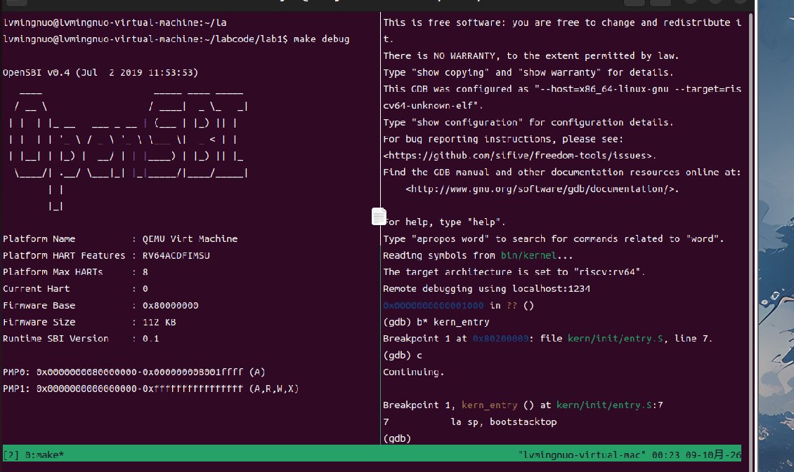

图 C-1 中，GDB 连接后先停在 `0x1000`，随后断点命中 `0x80200000` 的 `kern_entry`。它验证了调试连接和入口控制流，不能单独证明完整的编译过程。

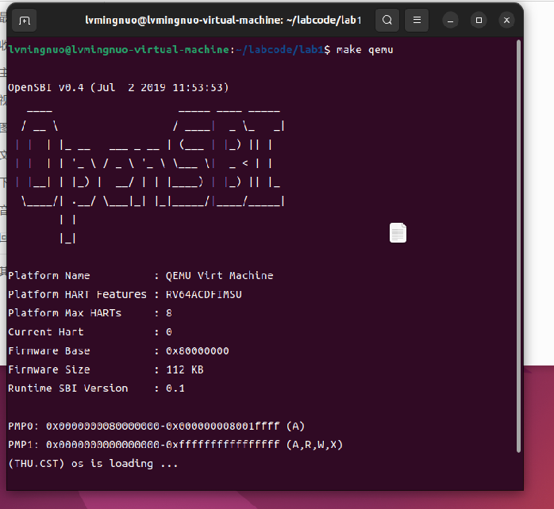

图 C-2 输出 `(THU.CST) os is loading ...`，说明该环境中内核已经进入初始化函数，并能够通过格式化输出和 SBI 服务向终端输出信息。它验证了本实验用到的路径，不代表完整输入输出、内存管理或其他内核功能均已实现。

#### 最终提示词

以下提示词来自本阶段提交的原始报告，用于分析构建系统，不要求修改课程代码。

````markdown
[PROMPT]
**任务**：分析 ucore lab1 的 Makefile 与 tools/function.mk，说明从源码到
bin/ucore.img 的完整构建流程，以及 make qemu 目标具体做了什么。
**操作要求**：只阅读和分析，不修改任何文件。结论必须以真实的 Makefile、
tools/function.mk、tools/kernel.ld 为准。
**输出要求**：给出构建链路各阶段（使用的工具与关键选项）、make 的依赖触发规则、
make qemu 各参数的作用、以及 function.mk 中宏函数的分工。

[RELY]
// 文件路径
Makefile、tools/function.mk、tools/kernel.ld
// 关键变量（来自 Makefile）
GCCPREFIX := riscv64-unknown-elf-
QEMU      := qemu-system-riscv64
OBJDIR    := obj
BINDIR    := bin
UCOREIMG  := $(call totarget,ucore.img)
// 关键系统约束
内核入口必须位于物理地址 0x80200000（由 kernel.ld 与 QEMU 加载参数共同保证）
内核不能依赖标准库，编译时使用 -nostdlib -nostdinc

[GUARANTEE]
本任务不涉及代码实现，只需输出分析结论。

[SPECIFICATION]
## 构建流程分析
**Pre-Condition**:
- 已读取 Makefile、tools/function.mk、tools/kernel.ld 的完整内容
**Post-Condition**:
- 给出完整构建链路，标注每一阶段使用的工具与关键编译/链接选项
- 说明 make 的依赖触发规则（目标与依赖的时间戳比较）
- 逐项说明 make qemu 目标中每个参数的作用
**Case 1**:
- 若 Makefile 中的变量、目标或链接脚本与讲义描述不一致，必须单独指出差异
**Requirements**:
- 严格区分"讲义中的写法"与"实际代码中的写法"，不得混为一谈
````


#### 实现迭代过程

**迭代次数：**

##### 第一次迭代

**遇到的问题：**

**问题解决策略：**

**最终结果：**

**关键改进点总结（如有）：**

## 五、测试与验证

| 验证内容 | 结果与含义 | 材料归属 |
| --- | --- | --- |
| 编译与镜像生成 | 交叉编译、链接和 objcopy 完成，生成 ELF 与原始镜像 | 启动流程阶段的编译截图 |
| ELF 入口 | 入口地址为 0x80200000，与 kern_entry 一致 | 启动流程与内存布局阶段的 readelf 结果 |
| 复位最初指令 | PC 从 0x1000 开始，六条 MROM 指令准备参数并跳往 OpenSBI | 启动流程阶段的 GDB 记录 |
| 固件到内核 | OpenSBI 的下一阶段地址为 0x80200000，内核入口断点命中 | 启动流程实测及运行验证阶段的入口断点截图 |
| 启动栈 | la 执行后 sp 为 0x80203000，预留空间为 8192 字节 | 启动流程与内存布局阶段的 GDB 与符号检查 |
| 汇编到 C | tail 将 PC 转到 kern_init，本次地址为 0x8020000a | 启动流程与内存布局阶段的单步记录 |
| C 函数使用栈 | sp 再向低地址下降 16 字节，随后保存返回地址 | 内存布局阶段的 GDB 记录 |
| 启动输出 | 出现 (THU.CST) os is loading ... | 启动流程与运行验证阶段的 QEMU 截图 |

练习一回答了两条入口伪指令各自的操作和目的：`la` 将启动栈顶部地址放入 `sp`，为后续 C 函数提供可用栈；`tail` 将控制权交给 `kern_init`，不为返回汇编入口设置新的返回地址。

练习二回答了最初指令的位置和作用：在本实验的 QEMU virt 平台中，CPU 从 `0x1000` 执行 MROM 代码，准备 hart 编号、设备树和固件动态信息等参数，再跳到 `0x80000000`。OpenSBI 初始化后进入内核入口 `0x80200000`。复位地址依赖具体平台，不能说所有 RISC-V 机器都从 `0x1000` 启动。

入口断点命中说明 CPU 已到达该地址，断点处的指令尚未执行；继续单步观察栈指针变化和进入 C 函数，才验证了入口指令的执行。该区别与“镜像已经放入内存”和“CPU 已经执行镜像”的区别相对应。

**测试截图：**

正文保留了各阶段的完整取证图片。以下集中列出编译、运行和入口调试结果，便于核对：


交叉编译、ELF 链接和原始镜像转换完成。ELF 入口与符号检查见练习二及内存布局模块。


启动信息验证了本实验使用的 C 初始化和 SBI 输出路径。各成员环境不同，固件版本和输出字段不要求完全一致。


单步后 sp 与 bootstacktop 一致，证明入口代码切换到了内核自己的启动栈。

**make grade 的适用情况：** 模板要求提供评分结果，但当前框架虽有 grade 目标，却没有 tools/grade.sh，无法获得有效的 make grade 评分截图。本报告不使用启动输出代替评分结果，也不声称自动评分通过。

---

## 六、实验总结与收获

### 对操作系统的理解

#### 重要知识点与 OS 原理的联系、差异

本表汇总各阶段的知识点对照。各章节已经给出代码和实测细节，这里集中说明它们与课程原理的关系。

| 实验知识点 | 对应 OS 原理 | 含义、联系与差异 |
| --- | --- | --- |
| MROM、OpenSBI 与内核的启动链 | 计算机引导与程序装入 | 固件先建立机器环境，再移交控制权。真实系统可能由引导程序从存储设备装入内核；本次镜像由 QEMU 在虚拟 CPU 执行前放置，OpenSBI 不负责从硬盘读出该镜像。 |
| ELF 与原始 BIN 镜像 | 可执行文件格式 | ELF 记录入口、装入描述、符号和调试信息，便于分析；原始镜像没有这些结构描述，需要外部约定加载位置。ELF 的文件偏移与运行地址也不是同一概念。 |
| 链接脚本和符号解析 | 编译、链接与装入 | 链接器组合目标文件并安排地址，加载者将内容放入内存。本实验按固定位置链接、加载；普通应用可以采用动态链接、重定位或地址无关代码。 |
| .text、.rodata、.data 与 .bss | 程序内存映像 | 各区域分别保存代码和不同性质的数据。它们说明一个程序如何布局，不等于操作系统已经实现了页表、动态内存分配等管理功能。 |
| edata、end 与清零 | C 运行环境初始化 | 链接符号提供边界，由内核自行清零相应区域；普通应用通常由加载器与运行时共同完成初始化。本次 edata=end，未观察到非空 BSS 被清零。 |
| 启动栈与函数调用 | 栈和调用约定 | 栈为保存寄存器、局部数据等提供空间，进入 C 前需设置 sp。本实验只有启动栈，尚无各进程独立的内核栈和上下文切换。 |
| M/S 特权级与 SBI ecall | 保护机制、受控的服务请求 | 本次由 S-mode 内核请求 M-mode 固件服务；通常的用户系统调用由用户态请求内核。二者具有相似的控制转移思路，但接口、功能号和寄存器约定由各自规范决定，不能说完全一致。 |
| sbi_call 的内联汇编 | C 与体系结构接口 | 显式执行 ecall 并准备约定寄存器，使 C 能调用底层服务。封装后调用者可以使用普通 C 函数接口；不是每个调用者都要手写汇编。 |
| 字符输出的多层封装 | 分层设计与设备抽象 | 内核把格式化、计数、字符接口和固件调用分开。多数封装是同一特权级内的函数调用，最后的 ecall 才跨到固件；完整 OS 还会加入驱动管理、缓冲等机制。 |
| vprintfmt 的函数指针 | 接口与实现分离 | 格式化引擎通过回调交付字符，不直接绑定输出设备。它与设备操作表等设计有联系，但本实验只是一个较小的实例。 |
| Makefile 与依赖文件 | 构建系统和增量编译 | 根据目标是否存在及依赖时间戳判断是否重建，组织编译、链接和镜像转换。这是开发工具的职责，与内核运行时的资源调度不同。 |
| GDB 断点与单步 | 系统调试与运行状态观察 | 通过 PC、寄存器与反汇编验证控制流。QEMU 提供远程调试接口，GDB 加载 ELF 符号；这种外部调试工具不属于当前内核自身实现的功能。 |

#### 本实验没有覆盖的重要 OS 原理

1. **进程与线程管理**。本实验的内核只有单一执行流，`kern_init` 打印一行后即进入死循环，没有进程控制块、没有调度器、没有上下文切换，因此不存在"进程"这一抽象。
2. **虚拟内存与地址翻译**。本实验全程使用**物理地址**（`0x80200000` 直接被装入并执行），尚未建立页表、未开启分页机制，因此没有虚拟地址到物理地址的转换，也没有缺页异常处理。
3. **文件系统**。本实验没有磁盘 I/O、没有 inode、没有目录结构；构建产物通过 QEMU 的 `-device loader` 直接加载，不经过任何文件系统。
4. **进程间通信与同步**。由于不存在多执行流，信号量、互斥锁、条件变量等同步机制在本实验中均无对应。
5. **用户态与保护机制**。虽然真实 RISC-V 系统中还存在 U 模式，但本实验没有任何用户程序，因此没有 U/S 特权级切换（`ecall` 只被用作 S→M 的服务请求），也没有地址空间的隔离与保护。
6. **中断与异常处理的完整机制**。本实验仅用到 `ecall` 这一种陷入方式，尚未建立中断向量表、未处理时钟中断、没有中断嵌套与中断屏蔽机制。
7. **设备驱动模型**。本实验只通过 SBI 间接使用控制台，没有直接操作设备寄存器，也没有统一的驱动接口与设备抽象层。
8. **死锁与资源分配**。没有并发与资源竞争，因此死锁的四个必要条件在本实验中无从体现。

#### 入口与内存布局阶段的学习体会

**负责人：** 2410849-张祖浩

这一部分让我改变了阅读入口函数的顺序。现在看 `kern_init()`，会先检查入口地址和启动栈，再阅读函数中的初始化过程。

此外就是栈指针的两次变化：先从固件使用的地址切换到 `bootstacktop`，再由 C 函数向低地址移动 16 字节。这样就会恍然发现，入口处设置的栈很快就被用来保存函数运行所需的信息！之前对“函数需要栈”的理解比较粗糙，这次能够用指令和地址说明它的具体用途。

链接脚本也需要结合构建结果理解。脚本写出了布局规则，`readelf` 和 `nm` 则能检查这些规则最终产生了什么结果。本次 `edata` 与 `end` 相同，就是一个需要根据实际文件说明的情况，不能完全照搬对 BSS 的一般描述。

目前对伪指令的转换、链接过程中的细节还需要继续学习。本实验已经能够通过入口地址和寄存器变化，说明内核如何从汇编进入 C 函数，但还没有涉及后续实验中的页表管理、进程调度等功能。这里讨论的代码和数据区域，也不能等同于操作系统课程中完整的虚拟内存管理。

### AI 协作开发的经验

负责人：2410878 吕明诺。

1. **"说清楚"比"说得多"更重要。** 最初用"帮我讲讲从 SBI 到 stdio 这条链"这类模糊提问，得到的是泛泛而谈；改为明确列出文件路径、给出已知的系统约束（S 模式 / M 模式）、要求引用真实函数签名之后，回答才具备可核对的准确性。这与实验讲义强调的"说清楚比说简洁更重要"是一致的。

2. **必须防止 AI 对不存在的代码产生幻觉。** 本实验所用的代码包存在文件缺失（如 `kern/trap/`、`kern/driver/clock.c` 均不存在）。若不明确要求"若函数不存在必须指出、不得臆测"，AI 很可能会依据 uCore 的通行版本"补全"出一份并不存在于本工程中的代码。**这是本次实验中最重要的一条经验。**

3. **要让 AI 区分"讲义写法"与"真实代码写法"。** `kernel.ld` 的差异就是这样被发现的：讲义把 `*(.text.kern_entry)` 单独列一行，实际代码则合并成了一行。若不加这条约束，很容易把讲义内容当作代码事实写进报告。

4. **AI 生成的解释必须用实测验证。** 例如"完整调用链已打通"这一结论，最终是通过 `make qemu` 实际输出 `(THU.CST) os is loading ...` 得到印证的。**代码能否跑起来，是检验理解是否正确的最终标准。**

5. **工具性手段往往比静态阅读更高效。** 面对 `tools/function.mk` 中复杂的 `$(eval ...)` 宏，直接阅读相当困难；执行 `make -n qemu` 打印展开后的命令序列则一目了然。遇到难以静态理解的构建系统，应当优先用工具观察其行为。

6. **AI 适合承担"梳理与核对"，不适合承担"判断与决策"。** 调用链的整理、选项含义的查询、讲义与代码的逐条比对，AI 效率很高；但"这个设计是否合理""两种写法是否等价"这类判断，仍需结合实测结果由开发者自行确认。**最终的负责人始终是开发者本人。**

本实验以理解和验证框架为主，AI 协作的结果主要体现为环境适配、分析与资料整理，不等同于由 AI 完成了一个新的操作系统。

---


